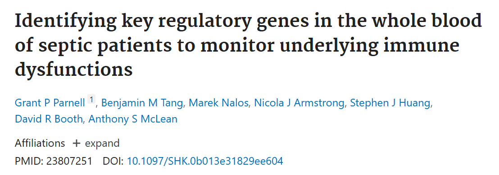
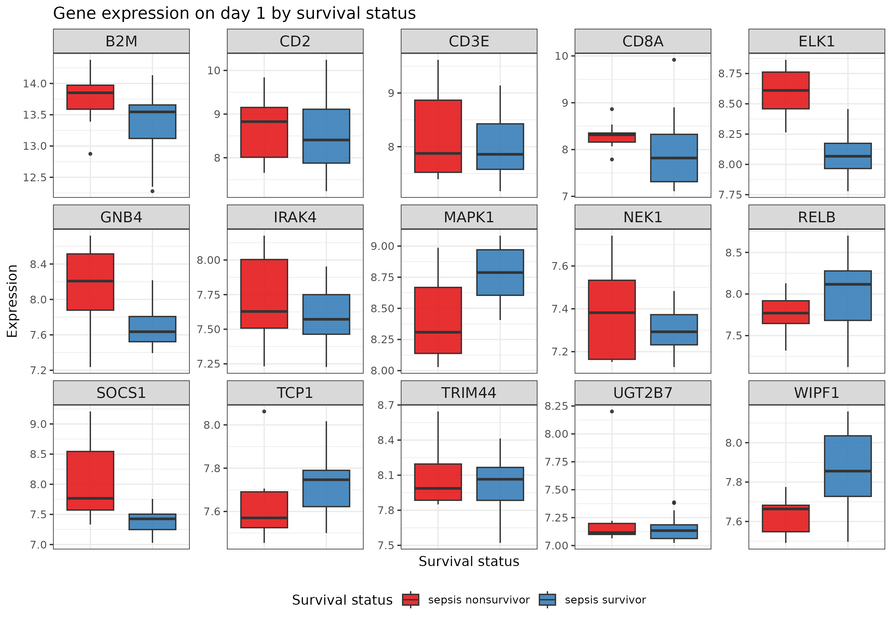
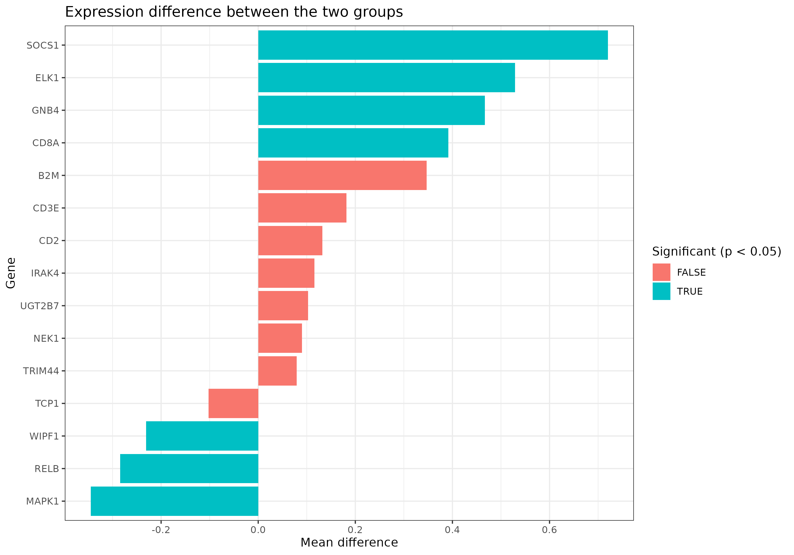
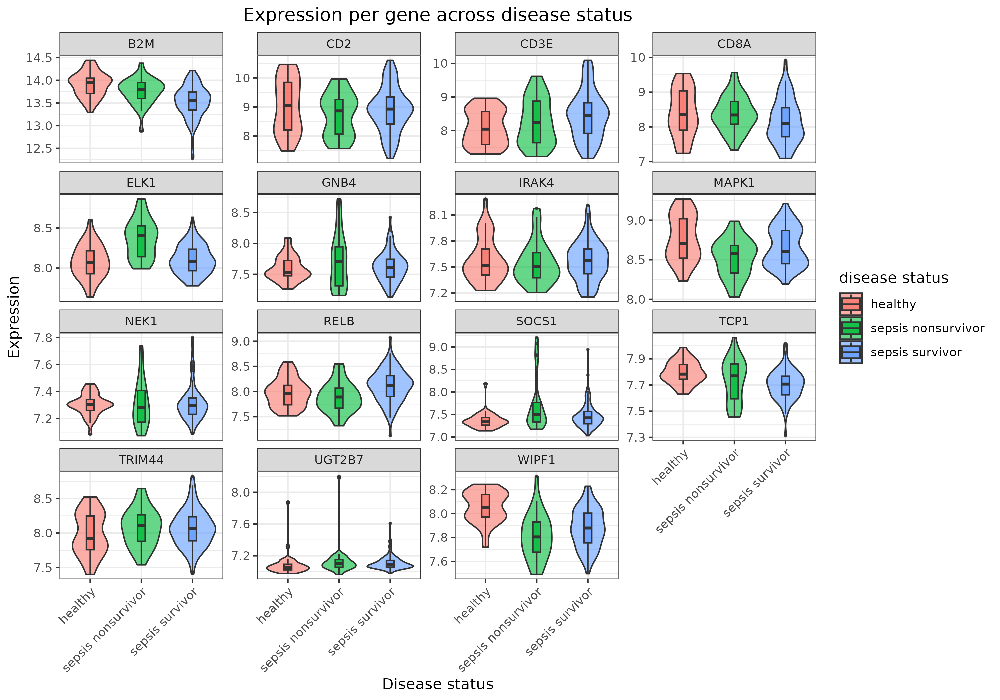
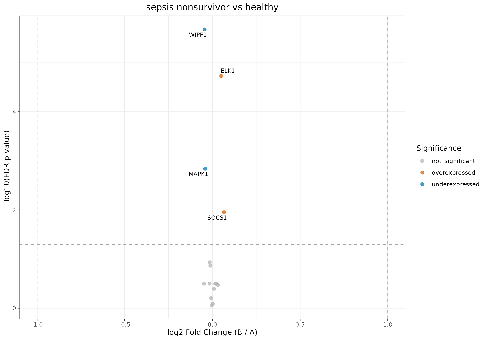

## Introduction

Our project is based on dataset GEOquery **\[GSE54514\]**

And **this** paper



## Materials and Methods

The raw data:

```{r}
# Read the TSV file
meta_untidy <- read.table("../data/01_meta_untidy.tsv",
                   sep = "\t",
                   header = TRUE)

library(reactable)
library(dplyr)
library(tidyverse)
library(tibble)
```

:::::: columns
::: {.column width="65%"}
```{r}
reactable(meta_untidy,
          sortable = TRUE,
          resizable = TRUE,
          height = "500px",
          theme = reactableTheme(
            style = list(fontSize = "20px")  # shrink text; default is 16px
          )
)

cat("dimension =", paste(dim(meta_untidy), collapse=" x "), "\n")
cat("Number of samples =", length(unique(meta_untidy$sample)), "\n")
```
:::

:::: {.column width="35%"}
::: {style="font-size: 0.7em;"}
But a tidy data set should follow these rules:

-   Every column contains exactly one variable.

-   Every row represents exactly one experimental unit (sample).

-   Every cell contains exactly one measurement.
:::
::::
::::::

## Materials and Methods

```{r}
gene_expression <- read_tsv("../data/expression_data.tsv")
gene_names <- read_tsv("../data/02_platform_table_clean.tsv")

#Rename so both have the same ILMN_ID
expression_data <- gene_expression |>
  rename(ILMN_ID = gene_ID)

annotation_data <- gene_names |>
  rename(ILMN_ID = ILMN_Gene)

merged_data <- expression_data |>
  left_join(annotation_data, by = "ILMN_ID")

gene_list <- c(
  "MAPK1","LFT","SOCS1","RELB","GNB4","B2M","IRAK4","WIPF1",
  "CD8A","CD2","ELK1","CD3E","TRIM44","UGT2B7","TCP1","ORC1L","NEK1"
)

# Check that the column Gene_ID exists in merged_data
if (!("Gene_ID" %in% colnames(merged_data))) {
  stop("The column 'Gene_ID' does not exist in merged_data.")
}

merged_data_clean <- merged_data %>%
  dplyr::filter(Gene_ID %in% gene_list)

#Keep only genes of interest
merged_data_clean <- merged_data_clean |>
  filter(!is.na(Gene_ID))

#Average values with same Gene_ID
clean_data <- merged_data_clean |>
  group_by(Gene_ID) |>
  summarise(across(starts_with("GSM"), mean, na.rm = TRUE)) |>
            ungroup()

meta_clean = read_tsv(file.path("../data/02_meta_clean.tsv"))
```

:::::: columns
:::: {.column width="45%"}
::: {style="font-size: 0.6em;"}
Merge `gene_names` and `expression_data`

``` r
merged_data <- expression_data |>
  left_join(annotation_data, by = "ILMN_ID")
```

Filter so it is only genes of interest

``` r
merged_data_clean <- merged_data |>
  dplyr::filter(Gene_ID %in% gene_list)
```

If gene has more than 1 `ILMN_ID`, get average of gene expression

``` r
clean_data <- merged_data_clean |>
  group_by(Gene_ID) |>
  summarise(across(starts_with("GSM"), mean, na.rm = TRUE)) |>
  ungroup()
```

Pivot and merge by `sample`

``` r
second_clean <- clean_data |>
  pivot_longer(
    cols = starts_with("GSM"),
    names_to = "sample",
    values_to = "expression"
  )

merged_final <- second_clean |>
  left_join(meta_clean, by = "sample")
```
:::
::::

::: {.column width="55%"}
```{r}
mf <- read_tsv("../data/03_merged_final.tsv")

reactable(
  mf,
  sortable = TRUE,
  resizable = TRUE,
  height = "600px",
  theme = reactableTheme(
    style = list(fontSize = "20px")
  )
)

cat("dimension =", paste(dim(mf), collapse=" x "), "\n")
```
:::
::::::

## Materials and Methods

```{r}
meta_separated <- meta_untidy |>
  separate(characteristics, into = c("key", "value"), sep = ": ", extra = "merge")

meta_wide <- meta_separated |>
  pivot_wider(names_from = key, values_from = value)

meta_wide <- meta_wide |>
  mutate_all(~ ifelse(. == "NA", NA, .))

meta_wide <- meta_wide |> select(-tissue)

meta_clean <- meta_wide |>
  separate(group_day, into = c("group_temp", "day"), sep = "_", remove = TRUE) |>
  select(-group_temp)
```

:::::: columns
:::: {.column width="45%"}
::: {style="font-size: 0.7em;"}
Separate `characteristics` into key/value pairs

``` r
meta_separated <- meta_untidy |>
  separate(characteristics, into = c("key", "value"), sep = ": ")
```

Convert long format to wide format

``` r
meta_wide <- meta_separated |>
  pivot_wider(names_from = key, values_from = value)
```

Replace string `"NA"` with actual `NA`

``` r
meta_wide <- meta_wide |>
  mutate_all(~ ifelse(. == "NA", NA, .))
```

Split `group_day` into two variables

``` r
meta_clean <- meta_wide |>
  separate(group_day, into = c("group_temp", "day"), sep = "_", remove = TRUE) |>
  select(-group_temp)
```
:::
::::

::: {.column width="55%"}
```{r}
reactable(meta_clean,
          sortable = TRUE,
          resizable = TRUE,
          height = "600px",
          theme = reactableTheme(
            style = list(fontSize = "20px")  # shrink text; default is 16px
          )
)
```
:::
::::::

## Materials and Methods

```{r}
pheno_data <- read_tsv("../data/phenotype_data.tsv")

pheno_data_control <- pheno_data |> 
  mutate(control = str_detect(title, '(Control)'))  |> 
  mutate(control = factor(control, levels = c(TRUE, FALSE)))  |> 
  group_by(control)

pheno_data_control <- pheno_data_control  |> 
  select(geo_accession, control)

merged_final_unfiltered = read_tsv(file.path("../data/03_merged_final_unfiltered.tsv"))

merged_unfiltered <- merged_final_unfiltered |> 
  select(Gene_ID, 
         sample, 
         expression)

merged_pheno_control <- merged_unfiltered |> 
  left_join(y = pheno_data_control,
            by = join_by(sample == geo_accession))

```

::::: columns
::: {.column width="50%" style="font-size: 0.7em;"}
Which `samples` are in the `control` group

``` r
pheno_data_control <- pheno_data |> 
  mutate(control = str_detect(title, '(Control)'))  |> 
  mutate(control = factor(control, levels = c(TRUE, FALSE)))  |> 
  group_by(control)
```

Merge `phenotype data`, `expression data` and `platform data`

``` r
merged_pheno_control <- merged_unfiltered |> 
  left_join(y = pheno_data_control,
            by = join_by(sample == geo_accession))
```
:::

::: {.column width="50%" style="font-size: 0.7em;"}
```{r}
merged_pheno_control |> slice_sample(n = 1000) |>
  reactable(sortable = TRUE,
            resizable = TRUE,
            height = "600px",
            theme = reactableTheme(style = list(fontSize = "20px")
                                   )
            )
```
:::
:::::

::: notes
Feature data: Gene_ID, sample

Phenotype data: sample, control

Expression data: sample, expression
:::

## Results

```{r}
merged_shiny = read_tsv("../data/03_merged_shiny.tsv")

reactable(merged_shiny,
          sortable = TRUE,
          resizable = TRUE,
          height = "600px",
          theme = reactableTheme(style = list(fontSize = "20px")
                                 )
          )
```

## Results

Boxplots for expression per gene in survivors vs non-survivors

{fig-align="center" width="2571"}

## Results

Difference in day 1 gene expression in survivors vs non-survivors

{fig-align="center"}

## Results
Expression per gene across disease status.

- Clear expression differences across healthy, survivors, and nonsurvivors.
- Innate immune genes (e.g., IRAK4, SOCS1) show higher expression in sepsis groups.
- T-cell–related genes (CD2, CD3E, CD8A) are lower in nonsurvivors, suggesting early immune suppression.

{fig-align="center"}
## Results
Volcano plot

- A small set of genes shows significant differences between nonsurvivors and healthy individuals.
- SOCS1 and ELK1 are upregulated, indicating early activation of inflammatory and transcriptional regulatory pathways.
- WIPF1 and MAPK1 are downregulated, suggesting reduced signaling activity linked to cytoskeletal regulation and MAPK pathways.
- Overall, the pattern points to early immune and signaling disturbances specifically associated with poor outcomes.

{fig-align="center"}

```{r expression_by_gene, echo=FALSE, message=FALSE, warning=FALSE, fig.width=12, fig.height=8}
library(ggplot2)
library(forcats)

 merged_final <- read_tsv("../data/03_merged_final.tsv")

ggplot(merged_final, aes(x = `disease status`, y = expression, fill = `disease status`)) +
  geom_violin(alpha = 0.6, trim = TRUE) +
  geom_boxplot(width = 0.15, outlier.size = 0.5, alpha = 0.8, coef = 1.5) +
  facet_wrap(~ Gene_ID, scales = "free_y", ncol = 4) +
  theme_bw(base_size = 14) +
  labs(title = "Expression per gene across disease status",
       x = "Disease status", y = "Expression") +
  theme(
    plot.title = element_text(hjust = 0.5),
    axis.text.x = element_text(angle = 45, hjust = 1),
    strip.text = element_text(size = 11)
  )
```

## Results

